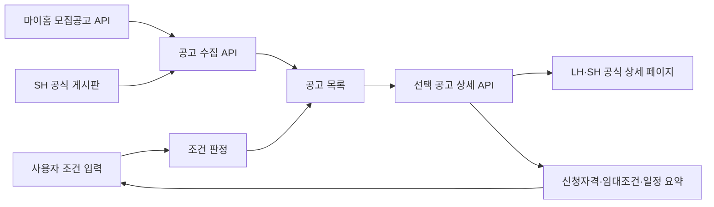

# 프로젝트 구조

## 한눈에 보기

## 실행 구조

| 경로 | 역할 |
| --- | --- |
| `app/page.tsx` | 프로필 입력, 조건 추천, 공고 목록과 상세 화면 |
| `app/globals.css` | 데스크톱·태블릿·모바일 반응형 스타일 |
| `app/api/notices/route.ts` | 실제 모집공고 통합 API |
| `app/api/notice-detail/route.ts` | 선택한 공식 공고 페이지의 핵심 내용 조회 |
| `app/lib/notice-sources.ts` | 마이홈·SH 수집과 공통 형식 변환 |
| `app/lib/audience-match.ts` | 나이·혼인·자녀 등 대상 계층 1차 판정 |
| `app/lib/notice-detail.ts` | 공식 상세 HTML 정리 및 핵심 구간 추출 |
| `app/lib/initial-notice-feed.ts` | API 응답 전 즉시 표시할 최근 정상 스냅샷 |
| `app/lib/notice-types.ts` | 공고·소스 데이터 타입 |
| `tests/` | 판정, 수집, 상세 추출, 서버 렌더링 회귀 테스트 |

## 데이터 흐름

1. 페이지는 최근 정상 스냅샷으로 먼저 렌더링됩니다.
2. 브라우저가 `/api/notices`를 호출해 최신 공식 공고로 교체합니다.
3. 사용자가 프로필을 수정하면 브라우저에서 조건 관련도를 다시 계산합니다.
4. 공고를 선택하면 `/api/notice-detail`이 해당 LH·SH 공식 페이지만 읽습니다.
5. 상세 응답에서 신청자격·임대조건·일정과 공식 경쟁률 문구를 표시합니다.

## 캐시

- 공고 목록: 15분 캐시, 오류 시 1시간 동안 이전 응답 재사용 가능
- 공고 상세: 6시간 캐시, 오류 시 24시간 동안 이전 응답 재사용 가능
- 브라우저 새로고침 버튼은 목록 요청에 현재 시각을 붙여 갱신을 시도합니다.

## 보안 경계

- 마이홈 인증키는 서버 코드에서만 읽습니다.
- 브라우저 응답과 HTML에 인증키를 포함하지 않습니다.
- 상세 조회는 `apply.lh.or.kr`, `i-sh.co.kr`, `www.i-sh.co.kr`만 허용합니다.
- 사용자 프로필은 현재 브라우저 메모리에만 있으며 외부 API로 전송하지 않습니다.
